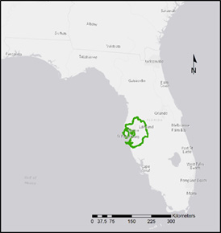
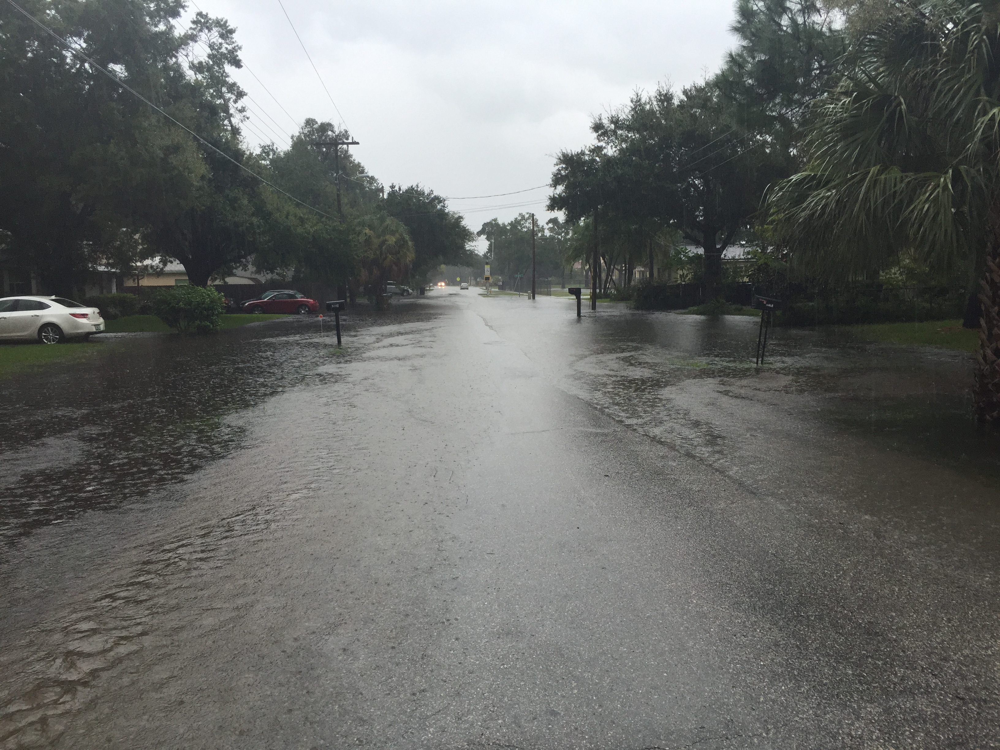
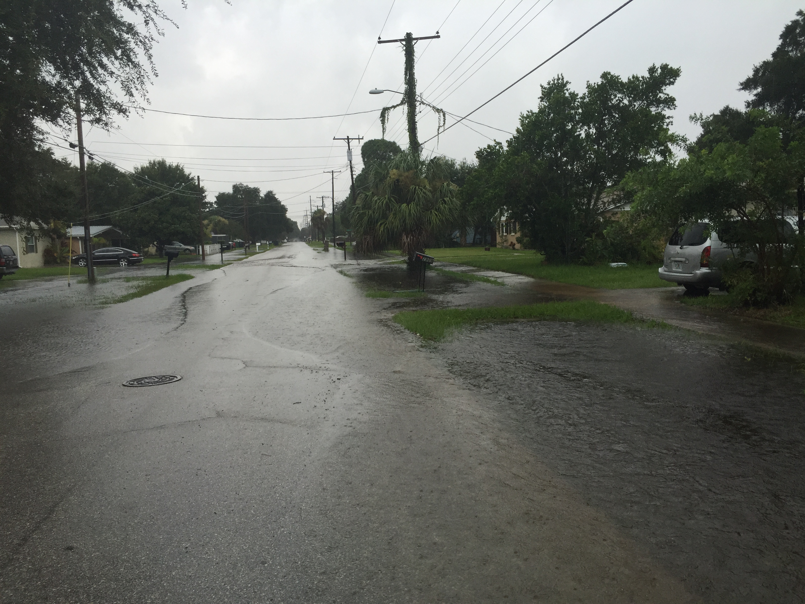
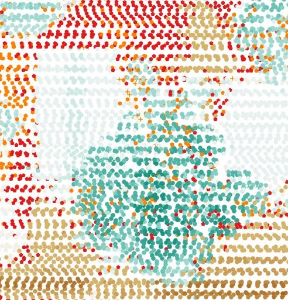

# Introduction
South Tampa also known as the Interbay peninsula, is a long (14 km / 8.6 miles) narrow (4 km / 2.5 miles), highly urbanized area with Tampa Bay shoreline on three sides (E,S,W).  

Tampa and the surrounding area lie in a zone of often heavy summer (June-September) precipitation, that combined with limited vertical relief can rapidly overwhelm natural drainage and municipal services (sewer, stormwater, etc).  In addition to the heavy summer precipitation, Atlantic hurricanes are a potential threat for both heavy precipitation and storm surge.  Finally, sea levels will rise as a result of anthropogenic climate change, reducing the already limited vertical relief; or an even flatter South Tampa.

# Driving Factor
During the summer of 2015 the Tampa area received heavy rainfall compared to seasonal averages; the author's calibrated backyard rain-gauge recorded 46.61 inches (118.4 cm) of rain from June 1st until August 31st, an amount equal to 211% of average during the period.  In addition to the well above average volume of precipitation, rain often fell in heavy spells lasting two to three days, June and August saw events with greater than 6 inches (15 cm) of precipitation in 48 hours.  This heavy rainfall, saturated soils and limited vertical relief resulted in large areas of South Tampa flooding.  Streets that were passable, rapidly became unpassable, with little visible indication why street X is flooded, but street Y is merely wet.  The images below highlight surface flooding on August 1st, the first image looks east (the Tampa Bay shoreline is 0.6 mile / 1 km down the street) while the second image looks west.  

 
  
 
 
The transportation issues that resulted from the flooding, which occurred during the middle of a workday - led to a normal commute of 15 minutes turning into a commute of 45 minutes in search of a route that wasn't flooded.  That event provided the impetus to either locate data or maps that may show routes that would be less likely to be flooded, or create maps to fill the gap in information.
 
# Objective
Using publicly available LIDAR data, build a terrain model that provides high fidelity ground elevation data.  Fidelity should enable modeling of water depth in inches or cm.  

## LIDAR, what's LIDAR? 
**LI**ght **D**etection **A**nd **R**anging is a survey method that utilizes a laser sensor to build a 3-D model of the terrain or object based on the returned laser energy.  LIDAR is not without its faults, vegetation can greatly hinder the ability of laser energy to strike the ground and return to the sensor.  The data used in this study was collected by an airborne sensor flying over the survey area during the peak of summer, when trees have full leaf cover. The data used in this study was collected by an airborne sensor flying over the survey area during the peak of summer, when trees have full leaf cover.  The image below is a LIDAR image color-coded to the height of the return.

Warm colors reflect returns that are at or near ground level, a darker cool color represents a higher return.  The large blue-ish green blob in the center of the image is a large Live Oak (a ground based photo of the oak is below).  Note the limited number of red or orange marks within the blue-green blob, the lack of those red or orange marks indicate that foliage interfered with laser energy.

